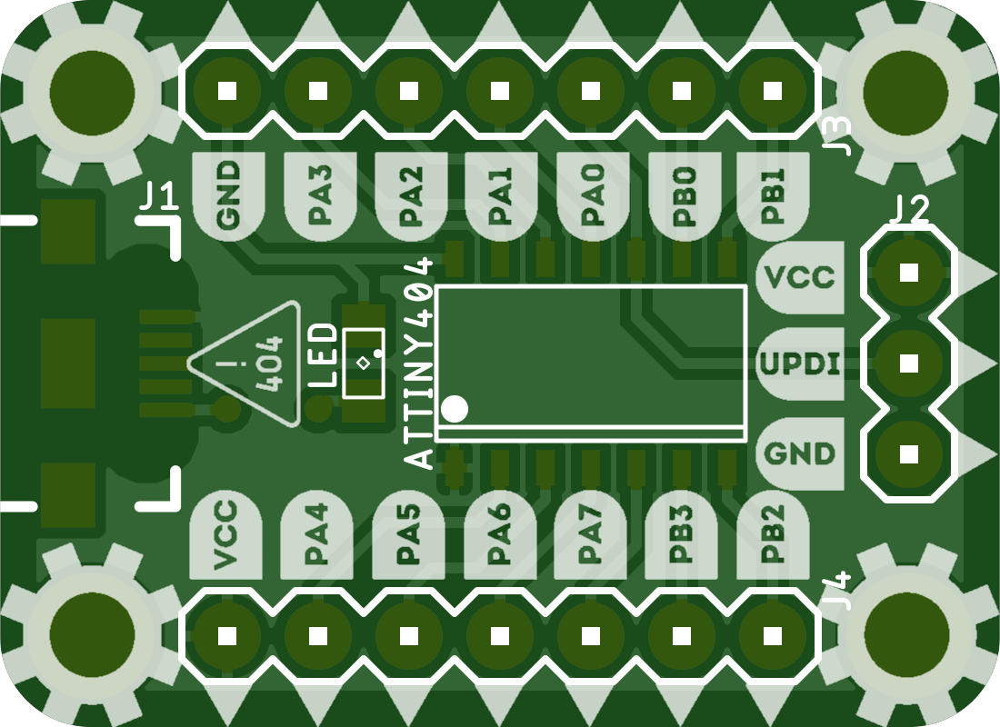
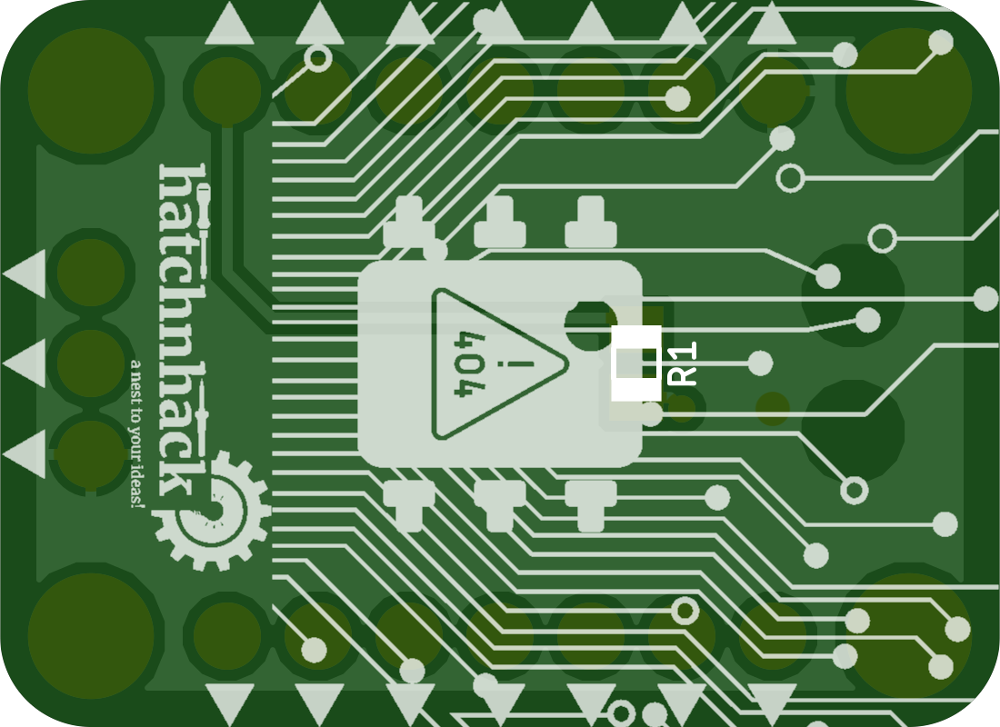

# HatchnHack ATtiny404 Breakout Board
8-bit AVR ATtiny404 breakout board with breadboard compatibility and micro USB for power. It has on-board LED connected to pin PB1.

---

### The TOP side

### The BOTTOM side

---

