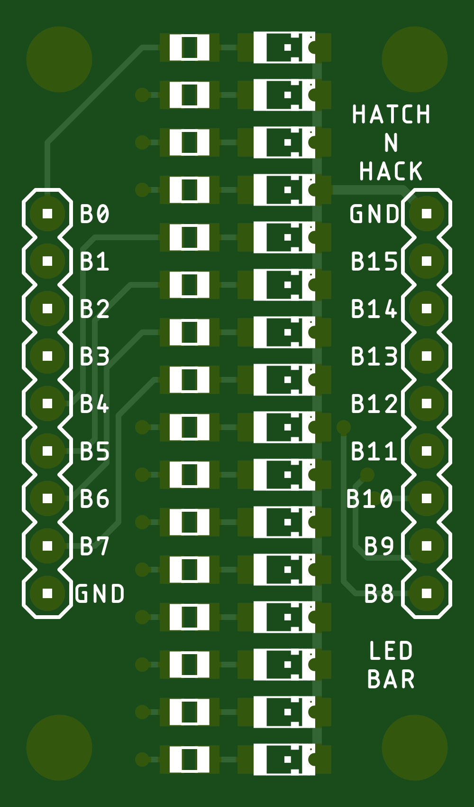
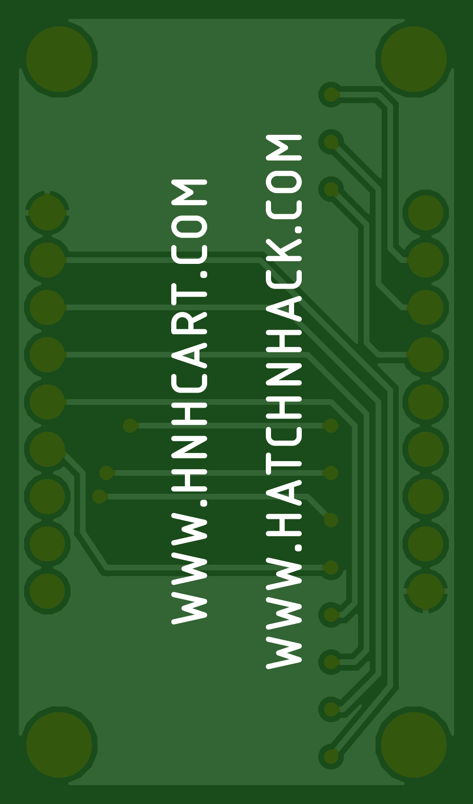

# HatchnHack LED Bar
16-Bit LED bar graph. Each LED can be individually controlled with logic high.

---

### The TOP side

### The BOTTOM side

---

## BOM
S.No. | Qty | Part | Value | HnHCart SKU
:---: | :---: | :---: | :---: | :---:
1 | 1 | Headers | 1x09 | [0U03d](https://www.hnhcart.com/products/header-male-1x10mm)
2 | 16 | Resistor | 330 | [00R11](https://www.hnhcart.com/products/330-ohm-smd-resistor-0805)
3 | 16 | Led | Red | [00R17](https://www.hnhcart.com/products/red-led-smd-1206)
