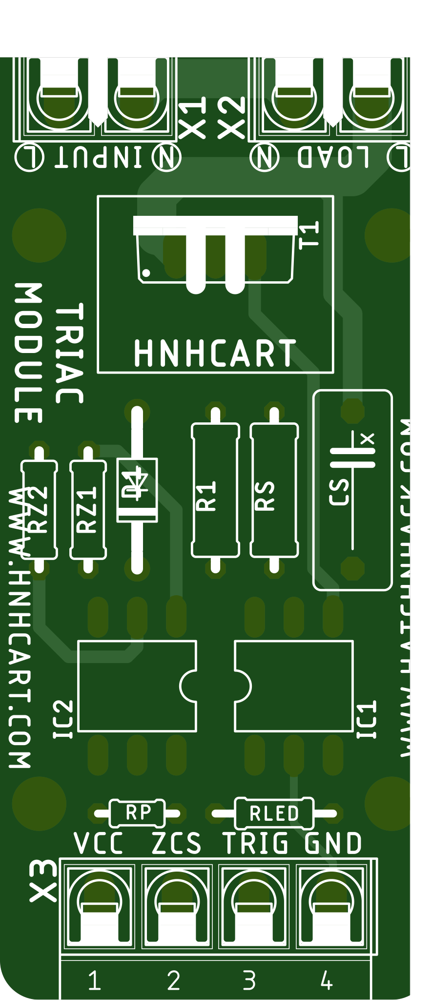
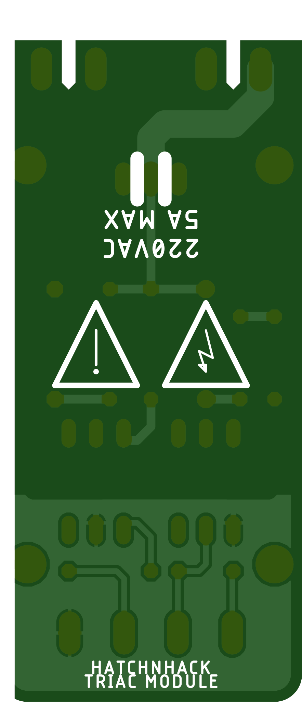

# HatchnHack Triac Module
Triac module with zero crossing detector circuit and snubber for applications including pwm dimming of lights, fans and AC loads.

---

### The TOP side

### The BOTTOM side

---

## BOM
S.No. | Qty | Part | Value | HnHCart SKU
:---: | :---: | :---: | :---: | :---:
1 | 2 | X1,X2 | 2 Pin PTR | [0C09](https://www.hnhcart.com/products/ptr_2-pin-connector)
2 | 2 | X3 | 4 Pin PTR| [0C09](https://www.hnhcart.com/products/ptr_2-pin-connector)
3 | 1 | RZ1 | 45K | []
4 | 1 | RZ2 | 360K | []
5 | 1 | D1 | 1N4007 | [0S01d](https://www.hnhcart.com/products/diode-1n4007)
6 | 1 | RP | 10K | [1R45](https://www.hnhcart.com/products/10k-ohm-1-8-watt-resistor-10-pieces)
7 | 1 | RLED | 390 | []
8 | 1 | R1 | 360 | []
9 | 1 | RS | 33 | []
10 | 1 | CS | 0.01u | []
11 | 1 | T1 | BT139 | [0T03d](https://www.hnhcart.com/products/bt139-600e-600-v-16a-triac-to-220)
12 | 1 | IC1 | MOC3052 | []
13 | 1 | IC2 | 4N35 | [0T10i](https://www.hnhcart.com/products/4n35-optocoupler-ic-dip-6-package)
