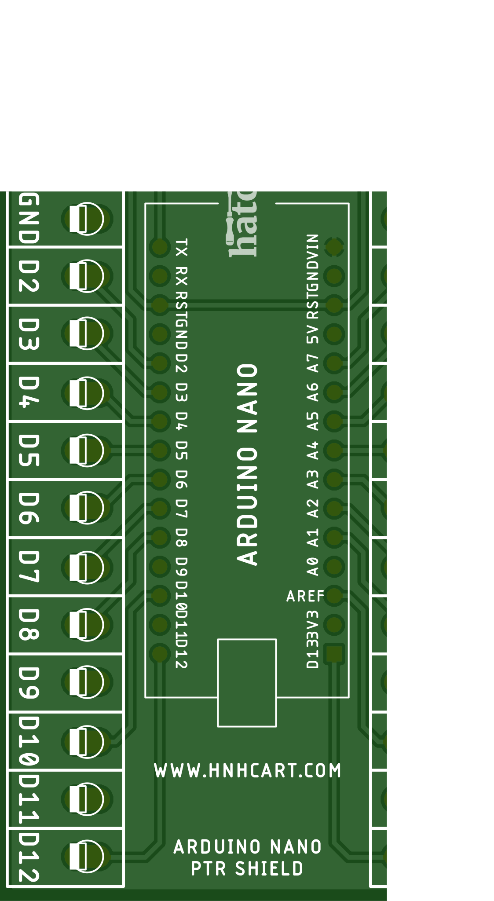
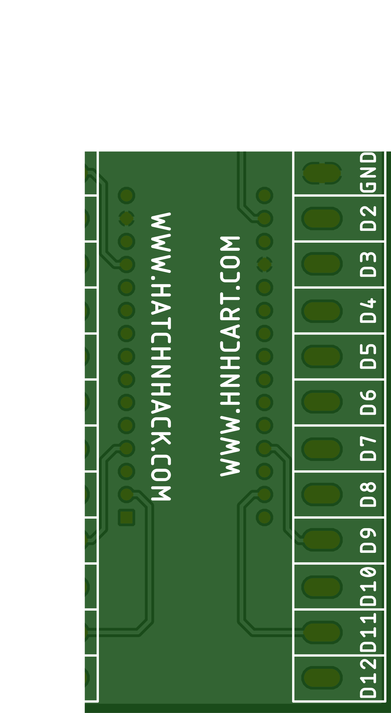

# Arduino NANO PTR Shield
Arduino Nano IO expansion shield with all the pins derived to screw terminals providing an easy and convenient connection interface.

---

### The TOP side

### The BOTTOM side

---

## BOM
S.No. | Qty | Part | Value | HnHCart SKU
:---: | :---: | :---: | :---: | :---:
1 | 10 | X1,X2 | 15 Pin PTR | [0C15](https://www.hnhcart.com/products/3-pin-ptr-connector)
2 | 1 | - | 1x15 | [0U03e](https://www.hnhcart.com/products/header-female-1x10mm)
