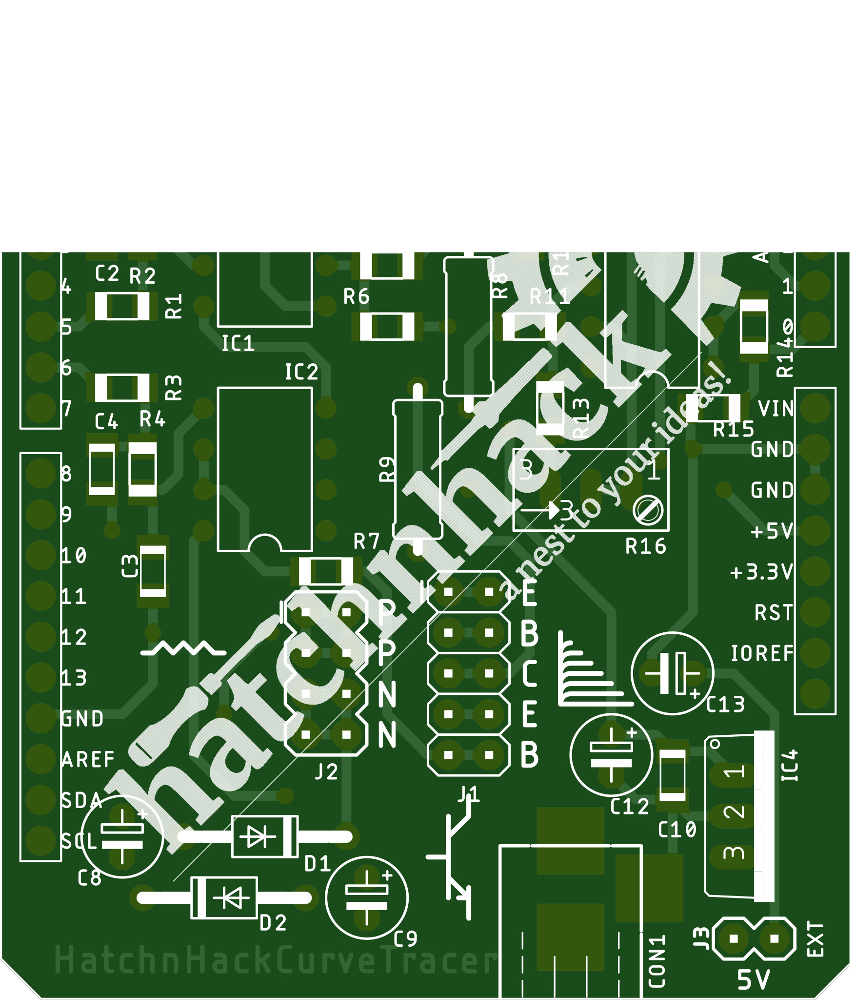
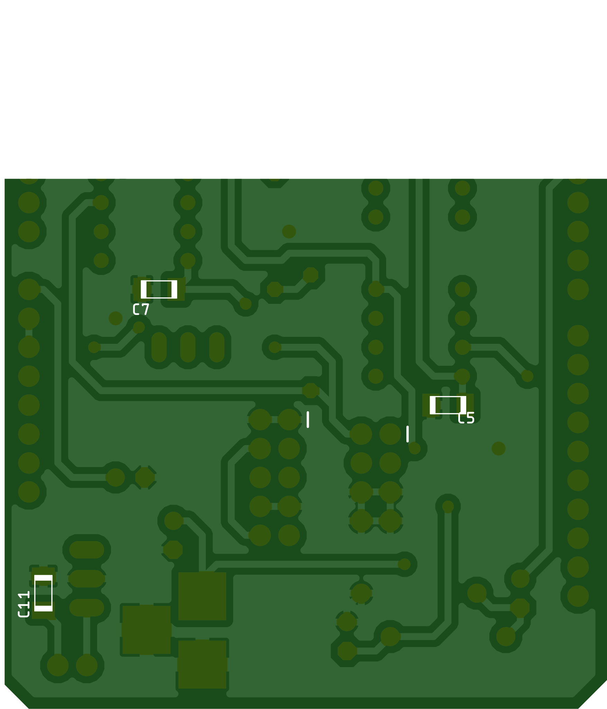

# Arduino UNO Semiconductor CurveTracer Shield
Semiconductor curve tracer shield can be used to plot I-V characterstics curves of resistors, diodes, LEDs, NPN and N-MOS on oscilloscope or PC or smartphone via bluetooth.

---

### The TOP side

### The BOTTOM side

---

## BOM
S.No. |  Qty  |  Part | Value | HnHCart SKU
:---: | :---: | :---: | :---: | :---:
1 | 1 | R8 | 10 | [0R04c](https://www.hnhcart.com/products/resistors-1-watt)
2 | 1 | R9 | 100 | []
3 | 1 | R15 | 10K | [000R3](https://www.hnhcart.com/products/10k-ohm-smd-resistor-10-pieces)
4 | 1 | R7 | 12K | []
5 | 1 | CON1 | DC BARREL JACK | [0C06](https://www.hnhcart.com/products/dc-jack-socket)
6 | 1 | J2 | 04X2 | [0U03c](https://www.hnhcart.com/products/male-double-row-header-strip-5-pcs)
7 | 1 | J1 | 05X2 | [0U03c](https://www.hnhcart.com/products/male-double-row-header-strip-5-pcs)
8 | 1 | R16 | TRIM-50K | [0D15](https://www.hnhcart.com/products/50k-multiturn-trimpot-trimming-potentiometer-through-hole)
9 | 1 | R13 | 68K | []
10 | 1 | IC4 | 7805 | [0T07I](https://www.hnhcart.com/products/lm7805-7805-ic-5v-voltage-regulator-ic-1)
11 | 1 | Q1 | BD139 | [0T02H](https://www.hnhcart.com/products/transistor-bd139-5-pcs)
12 | 1 | J4 | 04X1 | [0U03d](https://www.hnhcart.com/products/header-male-1x10mm)
13 | 1 | J3 | 02X1 | [0U03d](https://www.hnhcart.com/products/header-male-1x10mm)
14 | 2 | D1,D2 | 1N5819 | [0S01f](https://www.hnhcart.com/products/in5819-schottky-diode)
15 | 2 | C2,C4 | 1nF | [0X01b](https://www.hnhcart.com/products/1nf-1000pf-smd-capacitor-1206)
16 | 2 | C10,C11 | 1uF | [0X02b](https://www.hnhcart.com/products/1-uf-x7r-50v-smd-capacitor-1206)
17 | 2 | R2,R4 | 30K | []
18 | 2 | C1,C3 | 470pF | []
19 | 2 | R1,R3 | 47K | [000R3](https://www.hnhcart.com/products/47k-ohm-resistor-1206)
20 | 3 | C5,C6,C7 | 0.1uF | [000R5](https://www.hnhcart.com/products/0-1-uf-x7r-50v-smd-capacitor-1206)
21 | 3 | IC1,IC2,IC3 | LM358 | [0T08b](https://www.hnhcart.com/products/lm358-operational-amplifier)
22 | 4 | C8,C9,C12,C13 | 10uF | [0Q02b](https://www.hnhcart.com/products/polar-capacitors)
23 | 6 | R5,R6,R10,R11,R12,R14 | 100k | [000R4](https://www.hnhcart.com/products/100k-resistor-1206)

---

## Intefacing
