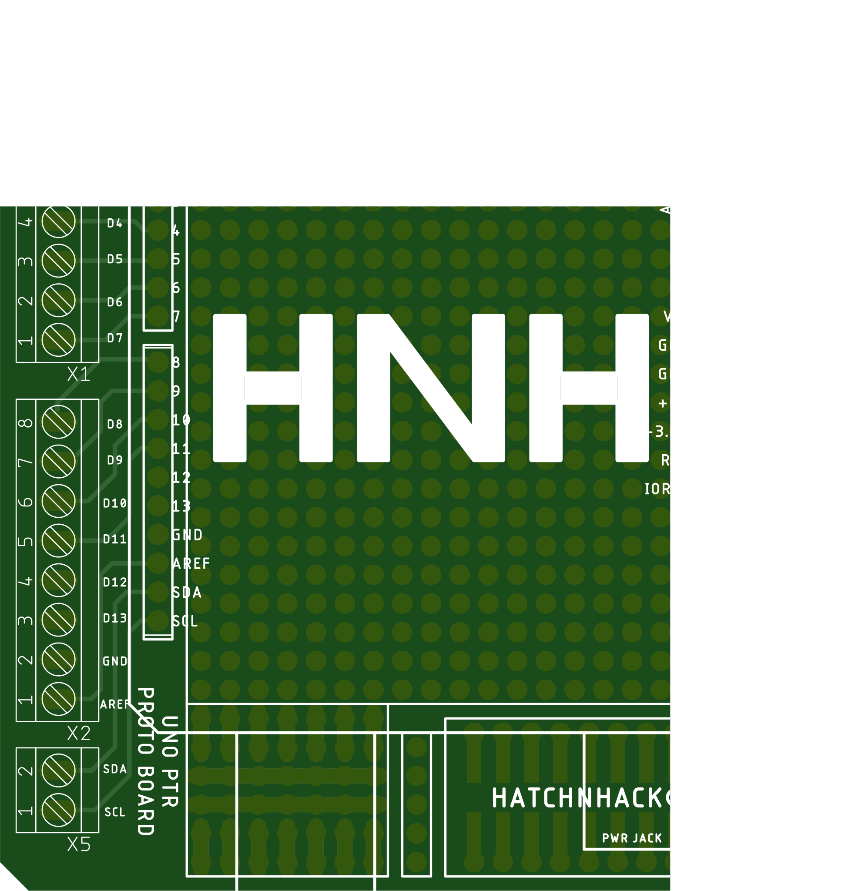

# Arduino UNO PTR Proto Shield
Arduino UNO PTR prototyping shield.
---
### The TOP side

### The BOTTOM side 

---
## BOM
S.No. |  Qty  | Part  | HnHCart SKU
:---: | :---: | :---: | :---:
1 | 2 | B1 | [0U03d](https://www.hnhcart.com/products/header-male-1x10mm)
2 | 1 | X5 | []
3 | 1 | X3 | []
4 | 3 | X1,X2,X4| []
5 | 1 | S1 | [0EE34](https://www.hnhcart.com/products/push-button-10-xx-10-peices)
