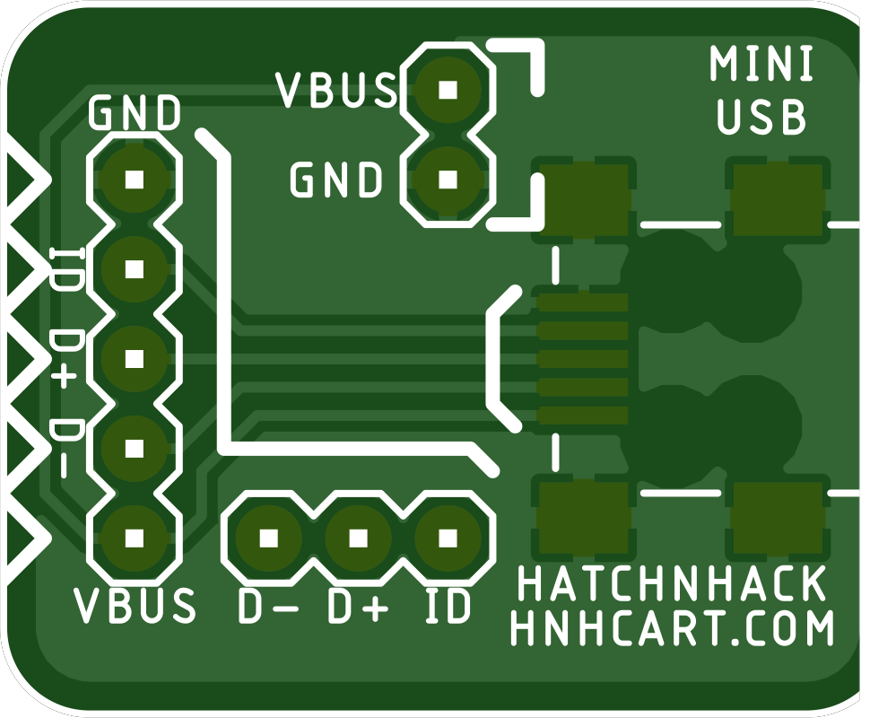
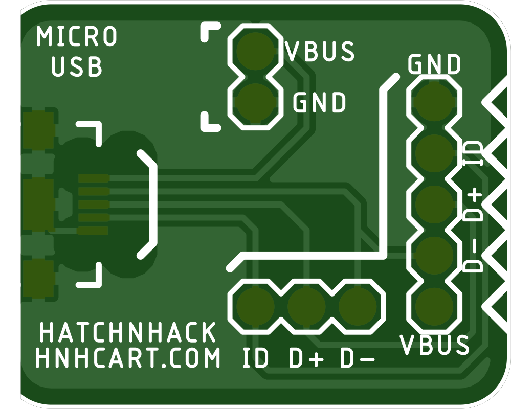

# USB Breakout Board
A USB (micro/mini) to breadboard breakout board.
---
### The TOP side 

 

### The Bottom side 

  

---

## BOM

S.No. | Qty | HnHCart SKU
:---: | :---: | :---:
1 | 1 | [0U03d](https://www.hnhcart.com/products/header-male-1x10mm)
2 | 1 | [0C19](https://www.hnhcart.com/products/mini-usb-jac-female-connector)
3 | 1 | [0C20](https://www.hnhcart.com/products/micro-usb-jack-b-type-female-connector-5-pin)
