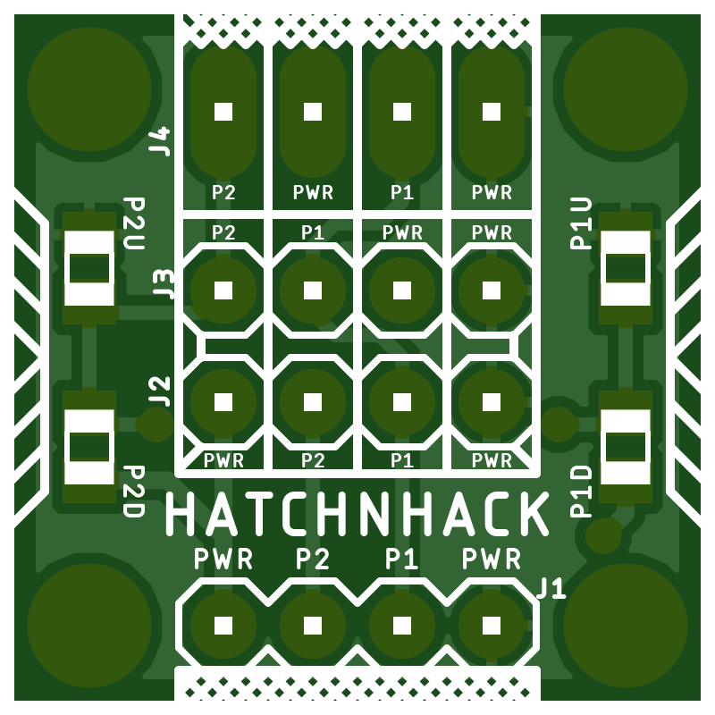

# Universal Sensor Proto Board
An universal sensor prototyping breakout board with pull-up or pull-down resistors  
that can be used to interface a variety of sensors like - 
* LDR
* LM35
* DHT11
* DHT12
* NTC
* IR Sensor
* Flex sensor
* Hall Effect sensor
---
### The TOP Side

 

### The Bottom Side 

---

## BOM
S.No. | Qty | Part | HnHCart SKU
:---: | :---: | :---: | :---:
1 | 1 | J1 | [0U03d](https://www.hnhcart.com/products/header-male-1x10mm)
2 | 1 | P1U or P1D | [R0805](https://www.hnhcart.com/search?type=product&options%5Bprefix%5D=last&q=0805+resistor)
3 | 1 | P2U or P2D | [R0805](https://www.hnhcart.com/search?type=product&options%5Bprefix%5D=last&q=0805+resistor)
